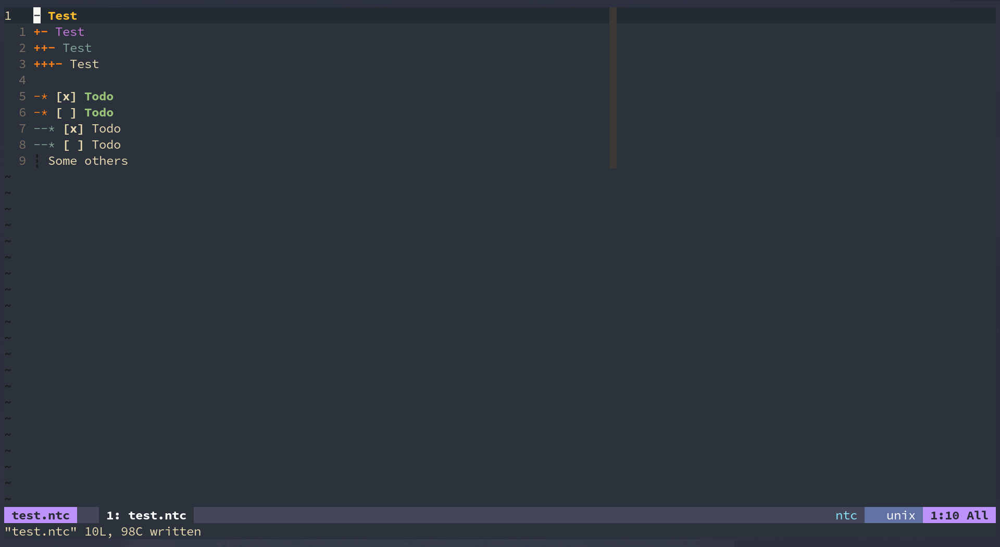

## NoToC.vim

[中文文档](./README_CN.md)  
[Github Repository](https://github.com/SpringHan/NoToC.vim)  
[Gitee Repository](https://gitee.com/springhan/NoToC.vim)

### Introduction

NoToC.vim is a vim plugin that can control notes and todos. This plugin is worked on `ntc` file type.

### ScreenShot



### Installation

You can install it by [vim-plug](https://github.com/junegunn/vim-plug) :

```vim
Plug 'SpringHan/NoToC.vim'
```

### Usage

You can run `:help notoc.vim` to get the help document, or run `:help notoc.vim@cn` to get the Chinese help document.

### Next step

I plan to add the some functions about todo's time control in the next version.

### License

MIT
